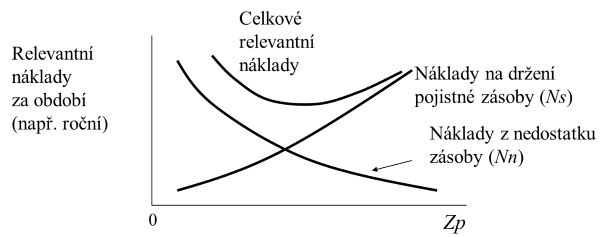
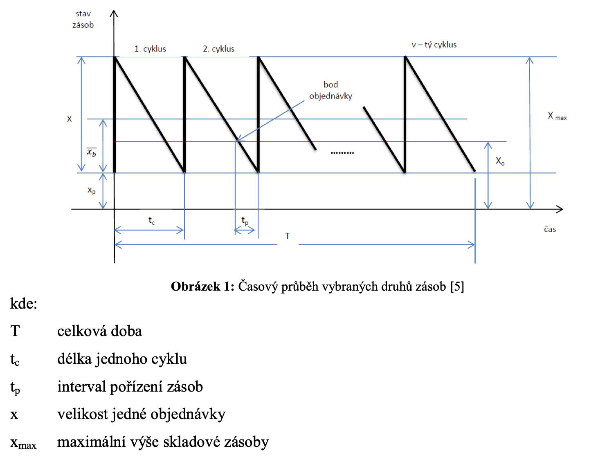
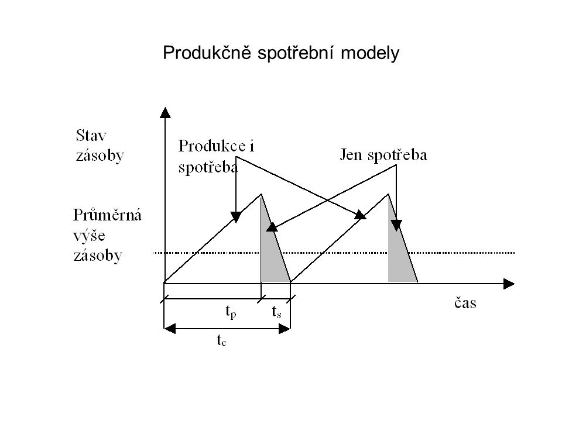
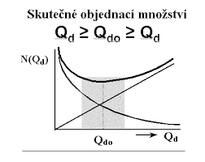
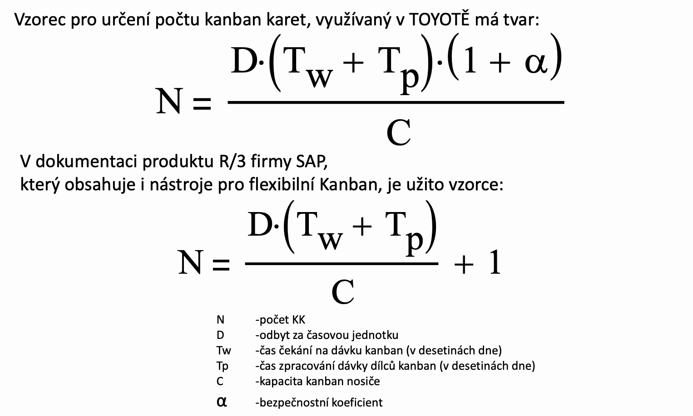

#

## Náklady na zásoby

- **Pořizovací náklady** - fixní charakter
  - příprava, vystavení a odeslání objednávky
  - na příjem, dopravu...
- **Náklady spojené s držením zásob**
  - na úroky z kapitálu uloženého do zásob (8 až 12.5 %)
  - na prostora na správu zásob cca 7 %
  - vyplývající z rizika neprodejnosti či nepoužitelnosti zásob (zkažení, móda, nepotřebnost)
  
**Celkem 15 až 35 %**

- Náklady z nedostatku zásob
  - náklady na express objednávku
  - penále za pozdní dodání
  - ušlý zisk

## Kdy je potřeba objednat?

- **Okamžik objednání záleží na** zvoleném **schématu řízení zásob** pro jednotlivé typy položek

- příslušný **systém řízení zásob volíme na základě charakteru zboží**

  - (spotřebě, obrátce, dodacích podmínkách, pořizovacích nákladech...)
  - **Sortiment** rezdělíme dle charakteru do skupin
  - Přiřadíme strategicky nejvhodnější model řízení

## Ukazatelé zásob

- **DOZ** - Doba obratu zásob = za jak dlouho se teoreticky obmění 100% zásoby
- **Index OZ** - index obratu zásob = kolikrát se zásoba obmění za sledované období (např. rok)
- Dodací lhůta a interval
- WIP - Work in proces = rozpacovanost ve výrobě [ks]
- LT - Lead time = průběžná doba výroby
- VA index = index přidané hodnoty

## Objedaní systémy

B = online sledování
b = fixní intervaly
S = narvu to po strop
Q = stejné množství

- **Systém (B, Q)**
.png)
- **Systém (B, S)**
.png)
- **Systém (b, Q)**
  - Pro B/C položky, nízká hodnota obděru bez nározových požadavků
- **Systém (s, Q)**
- **Systém (s, S)**
  - Pro B/C položky, vyšší hodnota odběru nepravidelně
- **Systém (s, T)**
  - pro náhradní díly
- **Systém 2 zásobníků**
- **Model přechodného neuspokojení poptávky**

- **Produkční model** - pro mezioperační zásoby

### Kolik je potřeba objednat?

- Lze určit napr. dle deterministických modeů jako je **Campův vztah**
- Dnes se pro A-čkové položky prefferují JIT/JIS dodávky
- Rozhodujícím kritériem je:
  - Kapacita transportních obalů a prostředků
  - Čas na zjištění potřeby zákaznííka a čas obstarání zboží od dodavatele
  - Čas potřebný na zpracování a dodání zboží k zákazníkovi
  - Zákaznický odbyt a způsob na odebírání

- Campův vzorec

- Vzorec KANBAN

