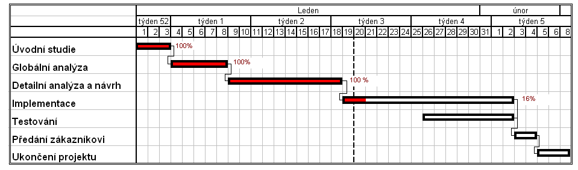
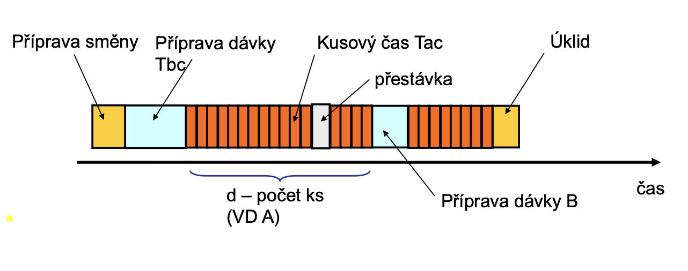
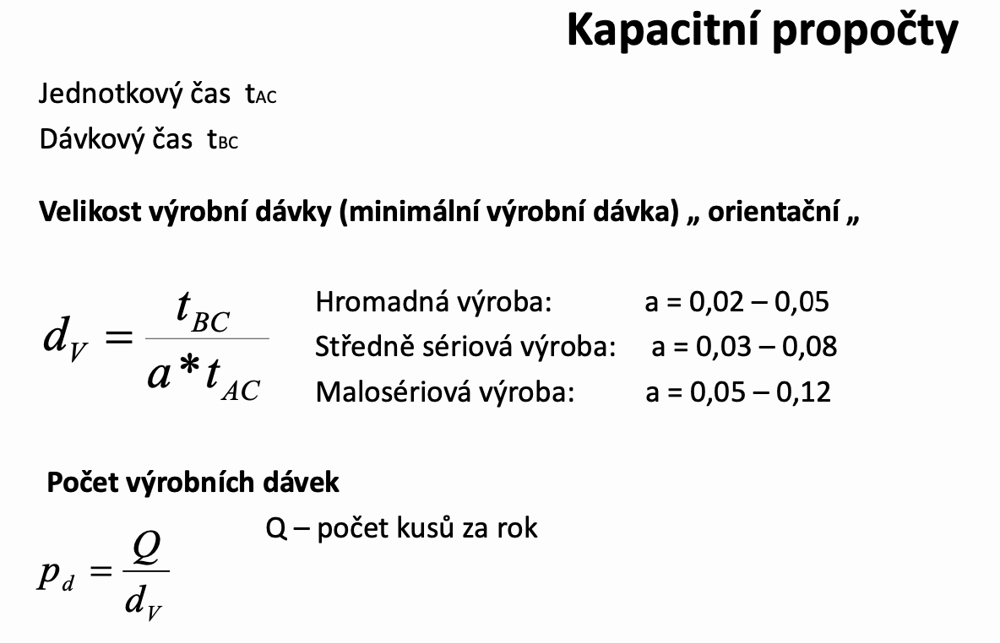

# Kapacitní propočty

- **Kapacita** - schopnost určitého zařízení (stroje, dílny) za optimálních podmínek vyrobit určité množství výrobků za určitou dobu

## Základní úlohy

- Propočet technických kapacit pro požadovanou produkci
- Propočet propustnosti současných kapacit
- Zjištění teoretického využití kapacit
- Kalkulace ceny výrobku

- **Dvě oblasti užití:**
  - Projektování výroby
  - **Plánování a řízení výroby**

>Dávkový čas = čas na přípravu dávky, čas na přetypování

## **Ganttův graf**

## Jednotkový X Kusový čas

jednotkový čas je část kusového času přísluší jedné dávce

> Výrobní dávka soubor částí s jednorázovým vynaložením nákladů na přípravu a zakončení příslušného procesu

