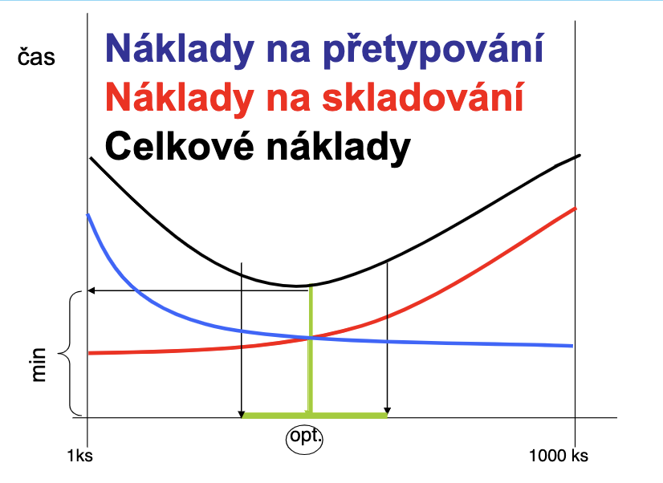
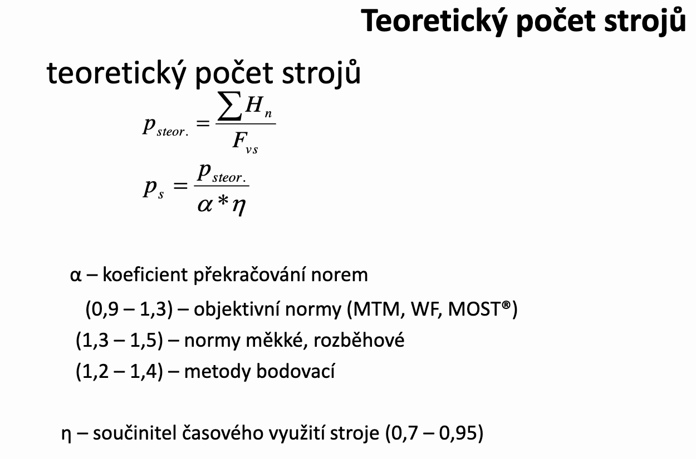

# Kapacitní propočty

- **Kapacita** - schopnost určitého zařízení (stroje, dílny) za optimálních podmínek vyrobit určité množství výrobků za určitou dobu

## Základní úlohy

- Propočet technických kapacit pro požadovanou produkci
- Propočet propustnosti současných kapacit
- Zjištění teoretického využití kapacit
- Kalkulace ceny výrobku

- **Dvě oblasti užití:**
  - Projektování výroby
  - **Plánování a řízení výroby**

>Dávkový čas = čas na přípravu dávky, čas na přetypování; začneme měřit, když ukončíme jednu dávku a ukončíme měření, když začneme vyrábět 2.

## **Ganttův graf**

## Jednotkový X Kusový čas

jednotkový čas je část kusového času přísluší jednomu kusu

### Kusový čas

$$ t = tac + tbc/d $$
***d - počet kusů v dávce***

> Výrobní dávka soubor částí s jednorázovým vynaložením nákladů na přípravu a zakončení příslušného procesu(počet kusů vyrobený na jedno seřízení); Výrobní dávka byla dokončena, když byl dokončem poslední dobrý kus minulé dávky

- Výrobní a seřizovací časy
- Výrobní dávky a zákaznické objednávky
- Pracovní fond
  - Počet zdrojů
  - Směnnost
- Vedlejší faktory
  - Nekvalita
  - Disponibilita
  - Rychlost ...

### Normohodiny

$$ Tac = (tac*Q) \over60 [Nhod/rok]$$
$$ Tbc = tbc* pd\over60 [Nhod/rok]$$

### Nároky na kapacity

$$Hn = Tac + Tbc [Nhod/rok]$$

|Roční využitelný fond (nominální)||
|--|--|
|$FVS = d*h*s*k2$|d - počet dní|
||h - počet h ve směně|
||s - směnnost|
||k2 - koeficient opravy(***dnes se moc nevyužívá***)|

## Funkční/pracovní místo

**Funkční místo** - Seznam pracovních činností, které budou prováděny včetně podílu činnosti tj. podíl (procento) času, tak aby součet všech činností na jednom

Funkčním - **pracovním místě** součet všech činností na pracovním místě porvaděných, dával obvykle hodnotu jedna (100%)

Adresné přiřazení činností, kompetencí a odpovědnosti funkčnímu místu

Využivá se tzv. interní **katalog pracovních činností**

## Prioritní pravidla

- **SPT** (shorter porcesing time) nejkratší procesní čas - odvedeme operace jako první
- **MWKR** (most work remaining) chceme zpracovávat co největší spektrum výrobků najednou
- **LWKR** (least work remaining) chceme zakázky co nejdříve odvést z úzkého místa
- **FCFS** (first come fisrt served) pro linky a plynulý chod
- **Random**

### Příklad 1

Pracovní norma je 240ks/směnu. Tento den se v yrobilo za 3 směny 510ks modrých dílů. Z těchto vyrobených dílů bylo 9ks špatně odlitých a u 6ks dalších, byla odhalena chyba materiálu. Forma j esložena ze tří dílů a stroj má zelenou barvu. V průběhu 8 hodin práce v každé směně se za celý den vyskytly 3 výpadky stroje. Nejprve se zasekla na 25 min forma.

OEE = $D*R*Q$

D = $Fvs - suma prostoje - suma setup \over Fvs$ = $1440-(25+40+15)-(10+20)*Pd\over1440$ = $1440-(25+40+15)-(10+20)*4\over1440$ = $ 1240\over 1440$ = 0.86

R = $počet kusů \over 1240/tac$ = $510 \over 1240/2$ = 0.82

Q = $Qm - Nok \over Qm$ = $510-(6+9) \over 510$ = 0.97

Qm = 510

dv = $suma tb\over a*tac$ = $10+20\over 0.1*(480/240)$
dv = 150

>tac je kusy za čas 480/240 (480 = 60*8)

pd = Q/dv = $510\over 150$ = 3.4 = 4

OEE = $0.86*0.82*0.97$ = 0.68

## Průmyslové revoluce

|||
|--|--|
|1.||
||- parní stroj|
||- první továrny napojeny na zdroj kynetické energie|
||- dělba práce|
||- kvalifikovaná místa a profese|
||- pracovaly děti a ženy|
||- vznik oboru strojní|
|2.||
||- zážehový, vznětový motor|
||- dynamo|
||- alternátor|
||- elektrikář, instalatér|
||- hygiena, kvalita|
||- porovnávání venice a vesnice a města s městem|
||- vzducholodě, parníky, telefon|
||- standartizace výroby a technických materiálů|
||- vysoká nedbalost na životní prostředí|
||- pásová výroba|
||- základy LEAN|
||- TPS-LEAN (TOYOTA Production System)|
||- štíhlá výroba, logistika, administrativa|
||- orientace na náklady|
|3.||
||- nasazení počítačů, PLC, první roboti, umělá inteligence|
||- plánovač, technolog, programátor, koordinátor|
||- snižuje se fyzická náročnost práce|
||- CIM(CAD, CAM, CAQ, CAx, PLM)|
||- SixSigma|
||- Motorola univerzity|
|4.||
||- nárust počítačových systémů|
||- |
