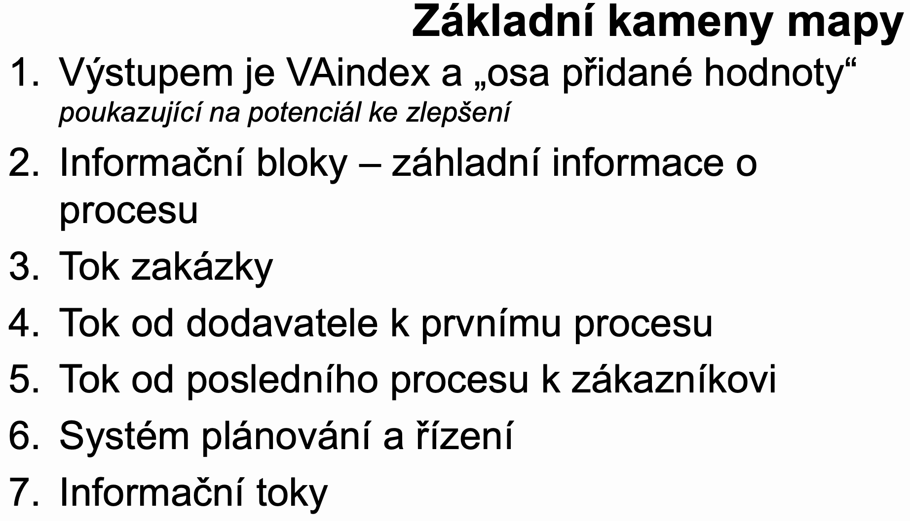
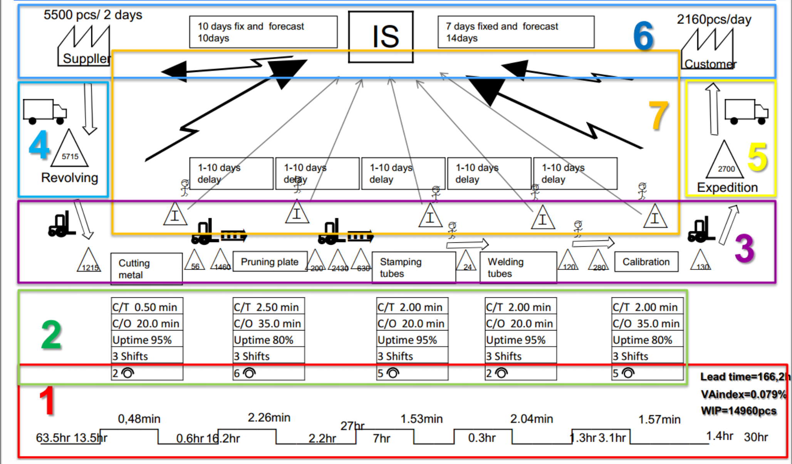
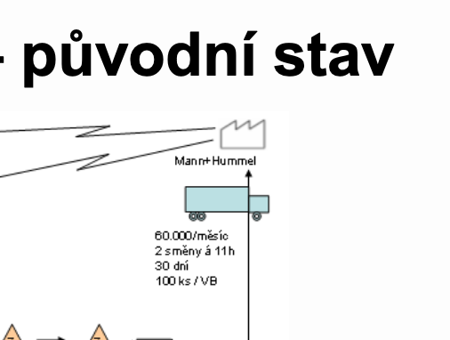
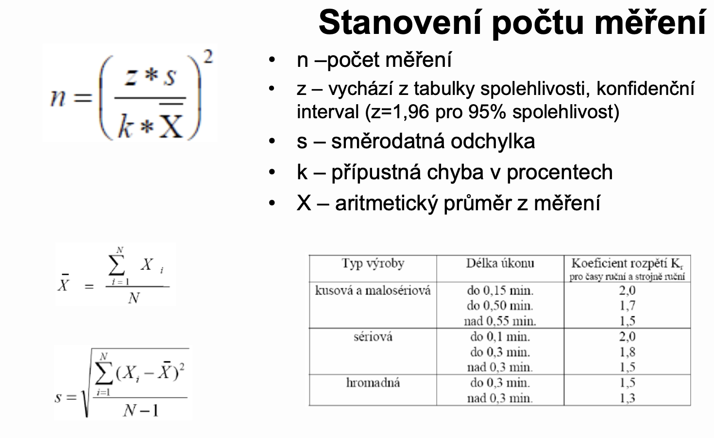

# Nástroje pro analýzu práce; Měření práce - přímé a nepřímé

## Příme měření X systémy předem určených časů

|||
|--|--|
|Potřebujeme stopky| Nepotřebuji stopky|
|Potřebujeme popsat, co měříme|Zaznamenávám konkrétní metodu práce|
|Provádíme hodnocení výkonu pracovníka|Neprovádím hodnocení výkonu pracovníka|
|Není citlivá na Ergonomii|Analýza citlivá na ergonomii|
|Není citlivá na metodu práce|Analýza citlivá na použité metody práce|

## Eliminujme plýtvání

1. Nadprodukce
1. Čekání
1. Zbytečná přeprava materiálu
1. Nesprávné výrobní postupy
1. Vysoké zásoby
1. Zbytečné činnost
1. Poruchy ve výrobě opravy
1. Nevyužitý lidský potenciál
1. Management

## Jak naložit s neefektivitou?

- 4 stádia zlepšování procesů na základě analýzy a měření práce
  - Zjednodušit, zlepšit
  - Přeuspořádat
  - Spojit
  - Eliminovat

## Před měřením

- Nejprve je nutné popsat dostatečně měřený proces. Odpověď na otázku, co měříme.
- Stanovit začátek měření.
- Stanovit konec měření.

**IPO**

>Zaznamenat: produkt, směnu, den, pracovníka atp. pro zpětnou diskuzii nad záznamem a správnou interpretaci měření

## Studie metod práce = analýza práce

- Získávání **informace o pracovních procesech**, které jsou následně analyzovány **s cílem objevit plýtvání**
- Cílem je **nalézt nejlepší cestu** jak dělat požadované činnosti

## Jak postupovat?

- Vyberte
- Zaznamenejte
- Přezkoumejte
- Navrhněte
- Zhodnoťte
- Definujte
- Zaveďte
- Udržujte

# Toky

viz ../Prezetace/Toky.pdf

*Nitkový diagram*

- vzdušnou čarou, kreslíme do layoutu a neznáme intenzitu toku

*Spaghetti diagram*

- vzdušnou čarou, kreslíme do layoutu a známe intenzitu toku

*Sankeyův diagram*

- nekreslíme do layoutu, zmáne intenzitu toku

*Digitální továrna*

- Hybridní diagram

## Zásady navrhování materiálních toků

1. Co nejkratší/ Nejrychlejší
1. Bez křížení
1. Jednoznačné
1. Jednosměrné
1. Dostatečně široké
1. Plynulé

# Value stream mapping

- jednoduchý vizuální nástroj pro analýzu sledovaného procesu (průběh zakázek procesem)
- vstupní analýza pro simulaci, optimalizaci, změnu organizace práce, redukci zásob, zkrácení průěžné doby výroby, audit při změně výrobku, managementu, navrhujeme-li nový proces

- zákazník určuje vlastnosti produktu přidávající hodnotu

## Parametry u procesů

- Cyklový čas
- Dávkový čas (čas přípravy)
- Disponibilitu
- Vzdálenost
- Směnnost
- Počet pracovníků
- Odborné požadavky
- Cenu práce
- CEZ (celkovou efektivitu zařízení)

### customer tact time

|Jak postupovat při analýze||
|--|--|
|Vyberte|- práci, ktrerá má být zkoumána (úzké místo)|
|Zaznamenejte|- vypovídající fakta o této práci|
|Přezkoumejte|- způsob jakým je práce vykonávána|
|Navrhněte|- celkově lepší metodu, jak práci vykonávat (levnější, rychlejší, snazší)|
|Zhodnoťte|- různé alternativy pro zlepšení vykonávané práce |
|Definujte|- novou metodu|
|Zaveďte|- novou metodu|
|Udržujte|- nový stav, kontrolujte jako prevenci proti návratu ka úvodnímu stavu|

## Chronometráž

**Plnulá chronometráž** po dobu pozorování se měří čas všech úkonů operace. Úkolem je zjistit skutečnou spotřebu času na jednotlivé úkony a na celou operaci, pokud se úkony zkoumané operace pravidelně opakují.

**Výběrová chronometráž** je druh chronometráže, při kterém jsou předmětem pozorování a měření pouze určité, dopředu vybrané prvky operace. Používá se k určení skutečné spotřeby času na vybrané pravidelně i nepravidelně se opakující, předem známé úkony.

**Obkročném chronometráž** se používá v případech, kdy je třeba zjišťovat délku trvání velmi krátkých, pravidelně se opakujících prvků operace. Protože v tomto případě je obtížné měřit délku každého prvku jednotlivě, měří se časy celých skupin pracovních úkonů, z nichž se dodatečně vypočítává délka každého z nich.

## Měření práce

- Aplikace techink pro určení **času potřebného na vykonání specifické práce kvalifikovaným dělníkem na definované úrovni výkonu**
- Slouží především **pro účely normování** práce
- Jsou zpravidla **podkladem pro racionalizace pracovních procesů**

## Metody určování spotřeby času

- **Z historického vývoje známe několik způsobů měření práce a definice časových norem**
  - Hrubý odhad
  - Využití historických údajů
  - Kontinuální časové studie přímým měřením
  - Systémy předem určených časů
- **Cíl měření**
  - Racionalizace práce
  - Definicce norem spotřeby času
- **Důvody měření**
  - Nová práce, výrobek, postup
  - Změna v postupu, materiálu, podmínek práce
  - Reklamace časových norem
  - Potřeba optimalizovat úzké místo
  - Porovnání alternativních metod
  - Redukce nákladů
  - Odměňování pracovníků

viz ../Prezetace/REFA-vs-MOST.pdf